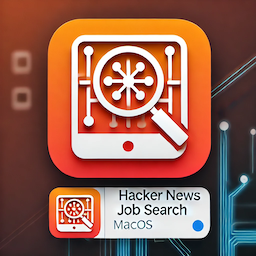
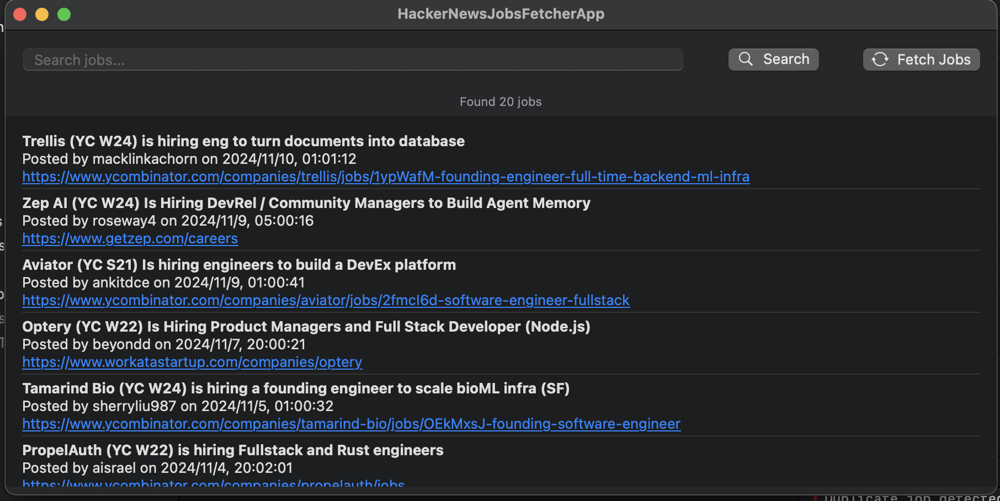

# HackerNewsJobsMacOS



HackerNewsJobsFetcherApp is a macOS SwiftUI application that fetches and displays job postings from Hacker News. This project uses Core Data to persist job data locally and includes basic search functionality to filter jobs by keyword.

- [HackerNewsJobsMacOS](#hackernewsjobsmacos)
  - [Features](#features)
  - [Requirements](#requirements)
  - [Installation](#installation)
  - [Usage](#usage)
  - [Project Structure](#project-structure)
  - [Demo](#demo)


## Features

- Fetches job postings from Hacker News API and saves them to Core Data.
- Displays job details, including title, poster, URL, score, and additional description.
- Supports keyword search to filter displayed jobs.

## Requirements

- macOS 12.0+ / macOS Monterey
- Xcode 13.0+
- Swift 5.5+
- Internet connection (for fetching data)

## Installation

1. Clone the repository:

   ```bash
   git clone https://github.com/binghuan/HackerNewsJobsMacOS.git
   cd HackerNewsJobsMacOS
   ```

2. Open the project in Xcode:

   ```bash
   open HackerNewsJobsFetcherApp.xcodeproj
   ```

3. Set up the Core Data model in Xcode by configuring `HackerNewsJobsModel.xcdatamodeld` if you need to make changes.

4. Build and run the app in Xcode.

## Usage

1. Launch the app to view the latest job postings from Hacker News.
2. Click "Fetch Jobs" to retrieve new job postings.
3. Use the search bar to filter jobs by title, text, or webpage content.

## Project Structure

- `ContentView.swift`: Main SwiftUI view displaying the job listings.
- `JobViewModel.swift`: ViewModel responsible for fetching and managing job data.
- `DatabaseManager.swift`: Handles Core Data operations including job data insertion and fetching.
- `NetworkManager.swift`: Manages network requests to the Hacker News API.

## Demo 

